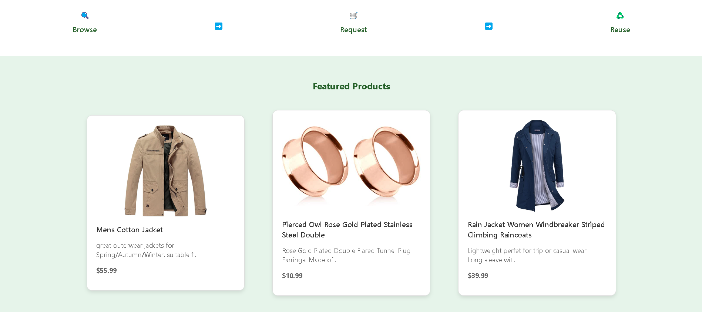
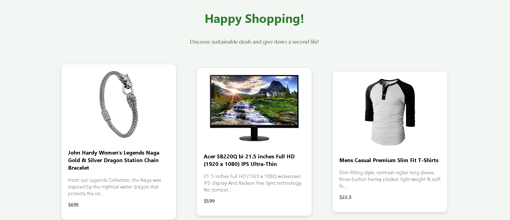
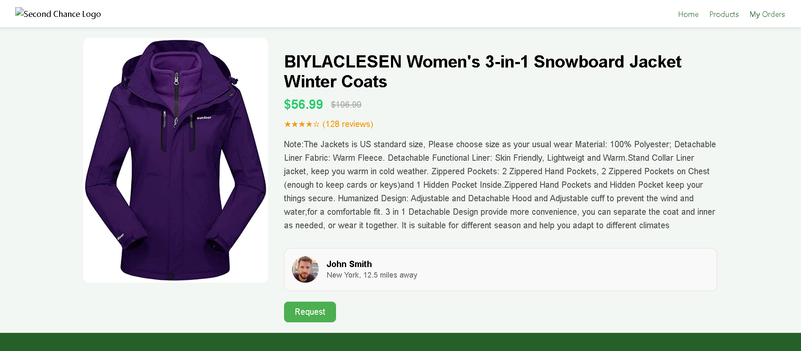

# Second Chance – Second-Hand Fashion Marketplace

Welcome to Second Chance, a React-based web application that connects users with high-quality second-hand fashion items. This platform promotes sustainability and affordability by allowing users to browse, view details, and request used products easily.

---

## 📦 Features

- 🛍️ View a curated list of second-hand products  
- 🔍 Explore detailed product information  
- 📝 Submit a request form for items of interest  
- 📧 Order requests are sent with user information (name, email, phone, etc.) to the backend via email  
- 📱 Responsive layout and accessible design  
- 🔄 Dynamic data loaded from Fake Store API  

---

## 💻 Technologies Used

- React (with functional components and hooks)  
- React Router DOM for navigation  
- Fetch API for retrieving product data  
- HTML5 & CSS3 (with semantic tags and responsive styles)  
- JavaScript ES6+

---

## 🖼️ Screenshots

### 🏠 Home Page  

### 📋 Product List  

### 🛍️ Product Details  

### 📤 Request Modal  

---

## 🏗️ Build Instructions

To generate a production-ready build of the project:

1. In the project root directory, run:
  
   npm run build
   
2. This will create an optimized build/ folder containing static files.

3. You can deploy this folder using any static site hosting service (e.g. GitHub Pages, Vercel, Netlify, or FTP to a server).

4. Make sure to configure your backend endpoint (e.g. `submit_order.php`) if using the request form in production.