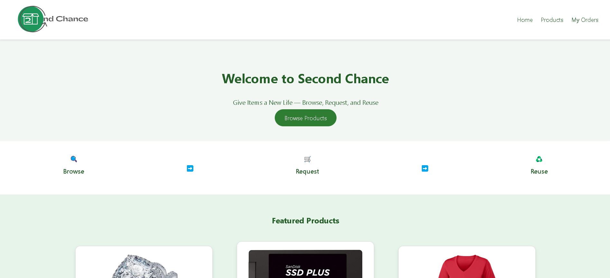
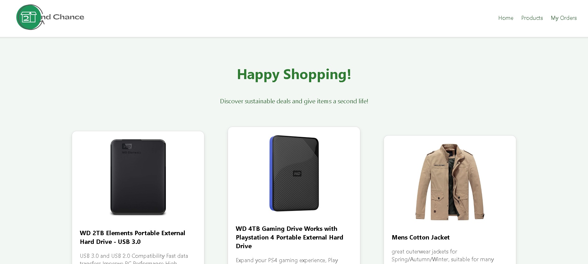
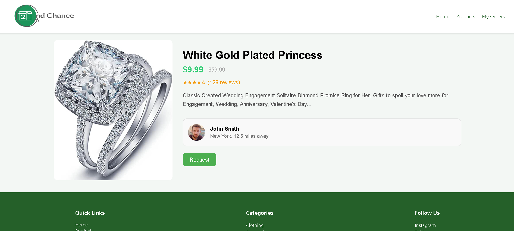
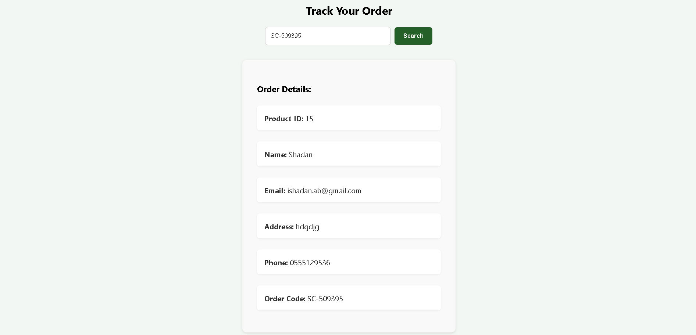

# Second Chance – Second-Hand Fashion Marketplace

Welcome to Second Chance, a React-based web application that connects users with high-quality second-hand fashion items. This platform promotes sustainability and affordability by allowing users to browse, view details, and request used products easily.

---

## 📦 Features

- 🛍️ View a curated list of second-hand products  
- 🔍 Explore detailed product information  
- 📝 Submit a request form for items of interest  
- 📧 Order requests are sent with user information (name, email, phone, etc.) to the backend via email  
- 📱 Responsive layout and accessible design  
- 🔄 Dynamic data loaded from Fake Store API  

---

## 💻 Technologies Used

- React (with functional components and hooks)  
- React Router DOM for navigation  
- Fetch API for retrieving product data  
- HTML5 & CSS3 (with semantic tags and responsive styles)  
- JavaScript ES6+

---

## 🖼️ Screenshots

### 🏠 Home Page  


### 📋 Product List  


### 🛍️ Product Details  


### 📤 Request Modal  


---

## 🏗️ Build Instructions

To generate a production-ready build of the project:

1. In the project root directory, run:
  
   npm run build
   
2. This will create an optimized build/ folder containing static files.

3. You can deploy this folder using any static site hosting service (e.g. GitHub Pages, Vercel, Netlify, or FTP to a server).

4. Make sure to configure your backend endpoint (e.g. `submit_order.php`) if using the request form in production.


## ⚙️ Backend Setup (PHP + MySQL on AMPPS)

To support order submission and tracking, use these three backend files in  AMPPS `www` folder:

### ✅ 1. `submit_order.php`

- Saves user request to the `orders` table  
- Sends confirmation email using PHPMailer  


Install PHPMailer with Composer:
```bash
composer require phpmailer/phpmailer
```

Set Gmail credentials:
```php
$mail->Username = 'secondchance.it22@gmail.com';
$mail->Password = 'tdbpaityojstibmc';
```

### ✅ 2. `check_order.php`

- Accepts an order code and returns matching order details  
- Used in the `MyOrders.js` page to track order status

### ✅ 3. Database Schema

Run this in **phpMyAdmin** (MySQL)

- you can find these files made as zip (database/server.zip)

---

## 🙌 Team

- **Jehan **
- **Raghad **
- **Ftoon **
- **Shrooq **
- **Shadan **

---

📚 References
PHPMailer – Send Emails via SMTP in PHP
https://github.com/PHPMailer/PHPMailer

React Router Documentation – Declarative Routing for React
https://reactrouter.com/en/main

Fake Store API – Mock REST API for E-Commerce
https://fakestoreapi.com/

W3Schools – PHP MySQLi and JSON
https://www.w3schools.com/php/php_mysql_intro.asp
https://www.w3schools.com/js/js_json_intro.asp

Mozilla Developer Network (MDN) – JavaScript and CSS Reference
https://developer.mozilla.org/

GitHub Pages Deployment Guide (Create React App)
https://create-react-app.dev/docs/deployment/#github-pages


---

## 📬 Contact

For questions, email:  
📧 secondchance.it22@gmail.com